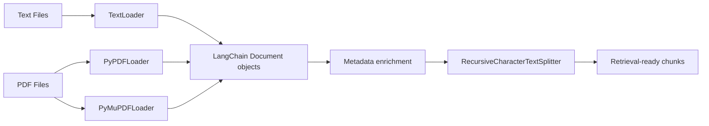

# RAG Data Ingestion Toolkit

A focused exploration of the document ingestion side of a RAG pipeline: loading text and PDF files through several LangChain loaders, enriching their metadata, and splitting them into retrieval-ready chunks, independent of any specific vector store or LLM.

## Problem

Ingestion quality determines RAG quality more than most people expect: the wrong loader, missing metadata, or a bad chunking strategy will quietly degrade every answer downstream. This project isolates the ingestion step on its own so different loaders and splitting strategies can be compared directly, before they are wired into a larger retrieval system such as the companion `rag-system-langchain` project.

## Architecture



Each loader produces LangChain `Document` objects with a `page_content` string and a `metadata` dictionary. The notebook enriches that metadata (for example `source_file` and `file_type`) before chunking, so downstream retrieval can filter or cite by those fields.

## Tech Stack

The toolkit uses `langchain-core` `Document` objects, `langchain_community` loaders (`TextLoader`, `DirectoryLoader`, `PyPDFLoader`, `PyMuPDFLoader`), and `langchain_text_splitters.RecursiveCharacterTextSplitter`, all driven from a Jupyter notebook with `pathlib` used for file discovery.

## How It Works

The notebook first constructs a `Document` by hand to show its shape, then loads a single text file with `TextLoader`, a folder of text files with `DirectoryLoader`, and a folder of PDFs with both `PyPDFLoader` and `PyMuPDFLoader` for comparison. A `process_all_pdfs` helper function walks a directory recursively, loads every PDF it finds, tags each resulting document with `source_file` and `file_type` metadata, and collects everything into a single list while catching and reporting per-file errors instead of failing the whole run.

## Key Features

The project demonstrates loader selection as a first-class decision rather than an afterthought by loading the same kind of content through more than one loader, adds traceability metadata to every document during ingestion, and keeps ingestion resilient to a single bad file through per-file error handling in `process_all_pdfs`.

## API Flow

There is no HTTP API in this repository; the "flow" is a data pipeline. Raw files enter through a loader appropriate to their type, are returned as a list of `Document` objects, gain enrichment metadata, and are split into overlapping chunks by `RecursiveCharacterTextSplitter`, ready to be embedded by a downstream project.

## Setup

```bash
git clone https://github.com/yrlmanoharreddy/rag-data-ingestion.git
cd rag-data-ingestion
uv sync
jupyter notebook notebook/document.ipynb
```

Sample text and PDF files are included under `data/`, so the notebook runs end to end without any external configuration.

## Testing

There is no automated test suite yet; each loader and the `process_all_pdfs` helper are currently verified by running the notebook and inspecting the printed document counts and metadata. Extracting `process_all_pdfs` into a plain module and adding `pytest` tests with small fixture files would be the natural next step.

## Deployment

This is a data-preparation notebook, not a deployed service. Its output (chunked, metadata-enriched documents) is meant to feed into a retrieval or embedding service such as `rag-system-langchain`, rather than being deployed on its own.

## Engineering Decisions

Loading the same PDFs through both `PyPDFLoader` and `PyMuPDFLoader` was a deliberate comparison, since different PDF loaders can extract text differently depending on document layout, and picking one without comparing is a common source of silent RAG quality issues. Per-file error handling in `process_all_pdfs` was chosen so one malformed PDF cannot silently stop ingestion of an entire directory.

## Status

Text and PDF ingestion, metadata enrichment, and chunking are implemented and runnable end to end against the sample data included in the repository. This project intentionally stops at chunking and does not include embedding or vector storage, which are covered separately in `rag-system-langchain`.
